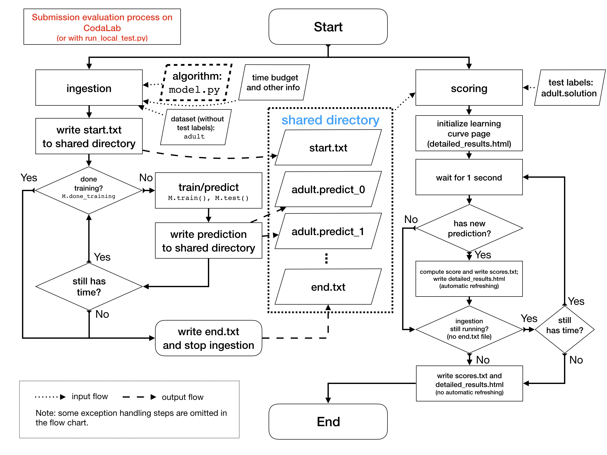

AutoDL
======================================

## Download 

You can download by clicking on the green button
"Clone or download" on top of
[this GitHub repo](https://github.com/Yaishnavi/AutoDL),
then "Download ZIP". You'll have this whole starting kit by unzipping the
downloaded file.

Another convenient way is to use **git clone**:
```
cd <path_to_your_directory>
git clone git@github.com:Yaishnavi/AutoDL.git
```
(If you are an experienced user of GitHub, feel free to
[fork this repo](https://help.github.com/en/articles/fork-a-repo) and
clone your own repo instead)

## Update 

As new features and possible bug fixes could be constantly added,  
you are invited to get latest updates **before each usage** by running
```
cd path/to/AutoDL/
git pull
```
(or by [syncing your fork](https://help.github.com/en/articles/syncing-a-fork)
if you forked this repo)

## Local development and testing
You can then test it on your local computer using Docker. Advanced
users can also run local test without Docker, if they install all the required
packages,
see the [Dockerfile](https://github.com/Yaishnavi/AutoDL/blob/master/Dockerfile).

If you are new to docker, install docker from https://docs.docker.com/get-started/.
Then, at the shell, run:
```
cd path/to/AutoDL/
```

The Docker image has `python=3.5.2` and has
installed packages such as
`tensorflow-gpu=1.13.1` (or `tensorflow=1.13.1` for `cpu`), `torch=1.3.1`,
`keras=2.2.4`, CUDA 10, cuDNN 7.5, etc. If you want to
run local test with Nvidia GPU support, please make sure you have
[installed nvidia-docker](https://github.com/NVIDIA/nvidia-docker) and run
```
nvidia-docker run -it -v "$(pwd):/app/autodl" -p 8888:8888 yaish/autodl:gpu-latest
```
The tag `gpu-latest` indicates that this image only supports usage of GPU.  
The option `-v "$(pwd):/app/autodl"` mounts current directory
`Autodl/`) as `/app/autodl`. If you want to mount other
directories on your disk, please replace `$(pwd)` by your own directory.
The option `-p 8888:8888` is useful for running a Jupyter notebook
inside Docker.

Make sure you use enough RAM (**at least 4GB**). If the port 8888 is occupied,
you can use other ports, e.g. 8899, and use instead the option `-p 8899:8888`.


The full usage is
```
python run_local_test.py -dataset_dir='AutoDL_sample_data/miniciao' -code_dir='AutoDL_simple_baseline_models/linear'
```
or
```
python run_local_test.py -dataset_dir='AutoDL_public_data/Munster' -code_dir='AutoDL_sample_code_submission'
```
You can change the argument `dataset_dir` to other datasets (e.g. the five
public datasets we provide). On the other hand,
you can also modify the directory containing your other sample code
(`model.py`).

## Run the AutoDL.ipynb
This is the Jupyter notebook to run. When you are in your
docker container, enter:
```
jupyter-notebook --ip=0.0.0.0 --allow-root &
```
Then copy and paste the URL containing your token. It should look like something
like that:
```
http://0.0.0.0:8888/?token=82e416e792c8f6a9f2194d2f4dbbd3660ad4ca29a4c58fe7
```
and select `AutoDL.ipynb` in the menu.

##  Result
Then you can view the real-time feedback with a learning curve by opening the
HTML page in `Scoring_output/`.

## Download public datasets
We provide several public datasets for participants. They can use these datasets to:
1. Explore data (e.g. using `data_browser.py`, see next section);
2. Do local test for their own algorithm;
3. Enable meta-learning.
These datasets can be downloaded on the competition website and we also provide
a script to facilitate the data downloading process. The usage
is:
```bash
python download_public_datasets.py
```
Note that this can take a few minutes, depending on your connection.

## Visualize datasets
*WARNING: to be run outside of a Docker container.*

We provide a script for visualizing random examples of a given dataset:
```bash
python data_browser.py -dataset_dir=AutoDL_sample_data/miniciao
```
You can change the dataset name `miniciao` to that of any other dataset
(e.g. `Munster`, `Chucky`, `Pedro`, etc.).

As all datasets are formatted into
[TFRecords](https://www.tensorflow.org/tutorials/load_data/tf_records),
this script actually provides a way to easily see what their
code receives as examples (and labels), especially for the participants who
are not familiar with this format.

## Evaluation

You may have following questions:
- How is a submission handled and evaluated on CodaLab? How is it implemented?
- What are ingestion program and scoring program? What do they do?

To answer these questions, you
can find a flow chart (`evaluation-flow-chart.png`) in the repo:



If you still want more details, you can refer to the source code at
- Ingestion Program: `Ingestion/ingestion.py`
- Scoring Program: `Scoring/score.py`
